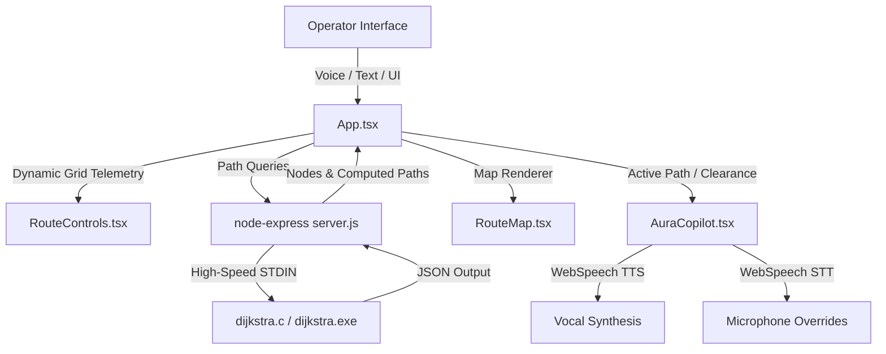

# FrostRoute — Cyber-Logistics Command Center & Tactical AI Deck

**FrostRoute** is a premium, state-of-the-art cybernetic logistics dashboard designed for severe Arctic environments. It combines high-speed, compiled low-level pathfinding algorithms with a responsive React visualization interface and **A.U.R.A. (Arctic Utility & Routing Assistant)**, an advanced vocal-enabled AI Tactical Copilot that enforces operator safety constraints, parses vocal overrides, and performs real-time telemetry route briefings.

---

## 🛠️ System Architecture



### 1. The High-Speed Pathfinding Core (Backend)
- **Engine:** Written in pure, highly-optimized **C (`dijkstra.c`)** using custom adjancency arrays and a binary min-heap Dijkstra queue solver.
- **Node-API Bridge:** An Express.js middleware server (`server.js`) bridges frontend calls with the C executable using standard I/O stream spawning, utilizing memory caches to preserve repetitive search requests.
- **Logistical Database (`data.js`):** Scaled to a complex system of **22 nodes, 37 edges, 6 premium restaurants**, and dynamically loaded coordinates.

### 2. Holographic Command Dashboard (Frontend)
- **Core Stack:** React, TypeScript, TailwindCSS, and Framer Motion (handling fluid, hardware-accelerated grid scanner effects).
- **Security Portal (`Auth.tsx`):** A biometric command lock featuring automated retinal grids, secure satellite handshake logs, credential checks, and flashing neon breach indicators.
- **User Authentication Context (`UserContext.tsx`):** Global state provider seeding Operator roles, mapping clearances, managing logouts, and dynamically caching custom operator sign-ups in local storage.

---

## ⚡ Core Functionality & Features

### 1. Cybernetic Auth & Dynamic Clearance Levels
FrostRoute secures the command deck by matching operator profiles to clearances:
- **Registration (Sign Up):** Dynamic registration form allows recruiting new operators (callname, email, password, role) and assigns clear security permissions.
- **Authentication Handshake:** Real-time simulated handshaking reports satellite verification checks before initializing the grid interface.
- **Operational Hierarchy:**
  - **Tactical Commander (Gold Badge):** Level 5 Override clearance. Unrestricted grid dispatch permissions.
  - **Field Courier (Amber Badge):** Level 2 Ground clearance. High ground-vehicle mobility.
  - **Logistics Analyst (Cyan Badge):** Level 3 Telemetry clearance. Grid telemetry monitoring only.

### 2. A.U.R.A. AI Tactical Copilot (v3.2)
A.U.R.A is a tabbed copilot dashboard housing local regex natural language parsing and Gemini satellite intelligence:
- **Speech Synthesis (Voice):** A.U.R.A. talks back to you! It greets you by your custom rank and name when you log in, and reads telemetry warnings vocally.
- **Dual Cognitive Cores:**
  - **Local Core:** Fallback regex NLP parsing commands like *"dispatch drone to work sector"* or *"set traffic density to 40% and optimize path"*.
  - **Gemini Satellite Core:** Open settings to bind a Gemini API Key. Gemini takes on the role of a military tactical AI, processing unstructured voice queries and returning structured command logs.
- **Active Diagnostic Console:** Real-time logs printing manual parameters edits (vehicle updates, hazard alerts, origin mappings) to simulate a military telemetry hud.

### 3. Role-Based Safety Overrides & Policies
The Tactical AI active monitors and intercepts unsafe dispatch parameters:
- **Analyst Dispatch Lock:** If an Analyst attempts to solve or dispatch a route, A.U.R.A blocks the solver button and reports: *"Security Advisory: Analyst profiles hold read-only clearance. Solver locked."*
- **Courier Blizzard Drone Override:** If a Courier attempts to dispatch a delivery Drone during severe weather (Blizzard), A.U.R.A. automatically intercepts the query, converts the vehicle to the robust ground **Ice Crawler**, solves the ground Dijkstra path, and flags: *"Safety Protocol: Courier drone operations restricted in Blizzards. Auto-converted to Crawler."*

### 4. 🎙️ WebSpeech Vocal Command Overrides
- **Microphone Scan Button:** Trigger the microphone in A.U.R.A's chat form to speak instructions.
- **Listening Pulse Cyberwaves:** Renders a gorgeous dark-red grid overlay displaying `AURA VOICE FEED: LISTENING...` accompanied by 14 animated audio frequency waves.
- **Vocal Telemetry Control:** Spoken commands are decrypted, translated, filled into the terminal, and auto-submitted for execution.

### 5. 🛰️ AI Tactical Route Briefing HUD
- **Slide-down HUD:** Computing a Dijkstra path automatically triggers a green-glowing corridor brief card.
- **Brief Telemetry Metrics:** Lists sector hop counts, solved route meters, and threat danger ratings.
- **Contextual Route Summaries:** AI writes custom safety assessments (e.g. warning of rotor drag on drone runs during heavy snow, standard ground velocities, or optimal air routes bypassing congestion).
- **Vocal Summaries:** A.U.R.A. speaks the summary aloud upon successful route lock.

---

## 🚀 Getting Started

### 1. Prerequisites
- **Node.js** (v18+)
- **GCC compiler** (for building the C executable, optional if `dijkstra.exe` is already compiled on Windows).

### 2. Setup & Installation
1. **Install Frontend Dependencies:**
   ```bash
   cd frontend
   npm install
   ```
2. **Install Backend Dependencies:**
   ```bash
   cd ../backend
   npm install
   ```

### 3. Running the Dashboard
1. **Launch the Node API Backend:**
   ```bash
   cd backend
   npm run dev
   ```
2. **Launch the React Vite Frontend:**
   ```bash
   cd ../frontend
   npm run dev
   ```
3. Open **[http://localhost:5173/](http://localhost:5173/)** in your browser to command the deck!
